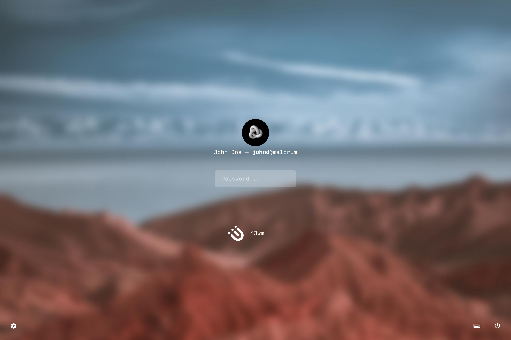
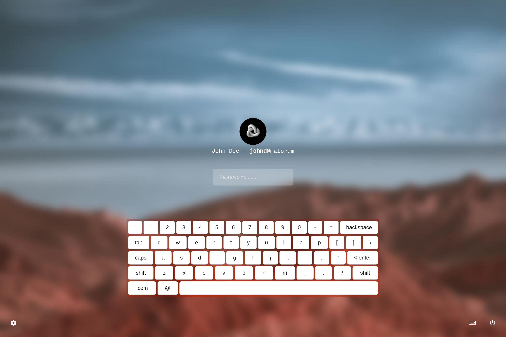
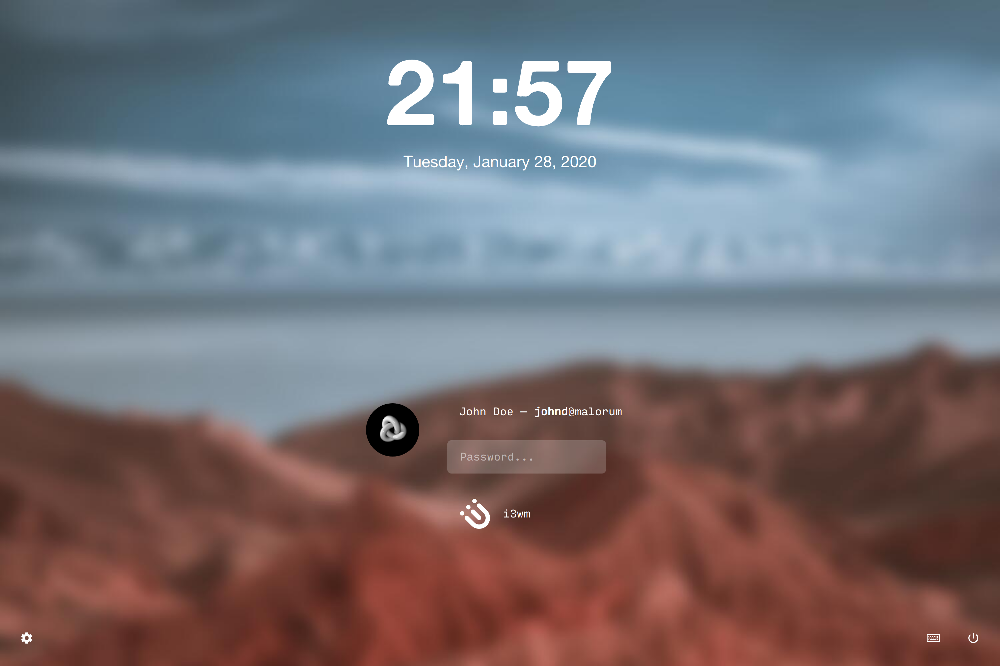
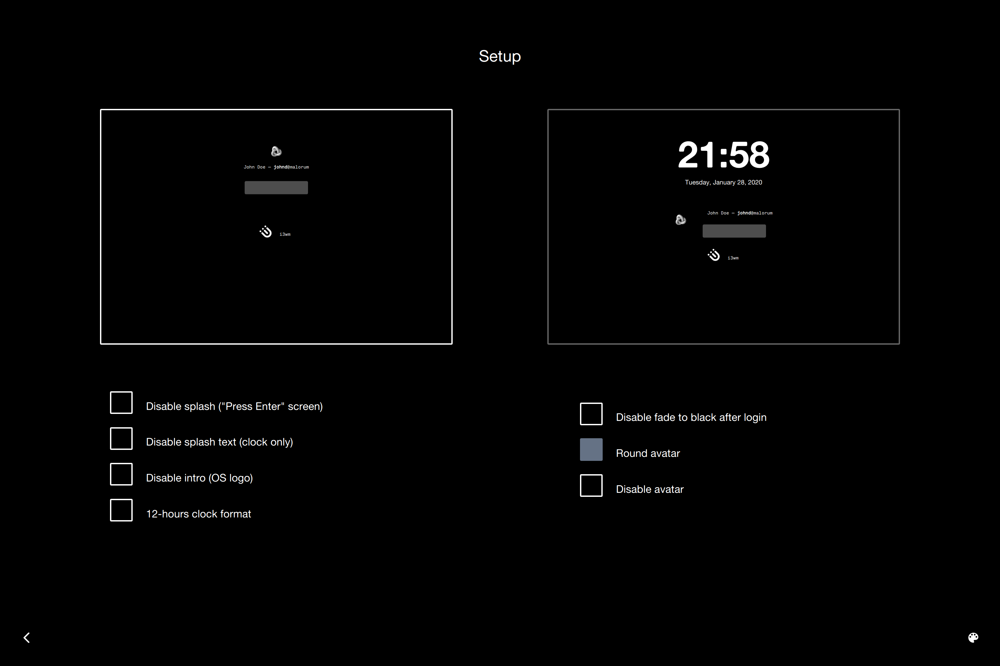
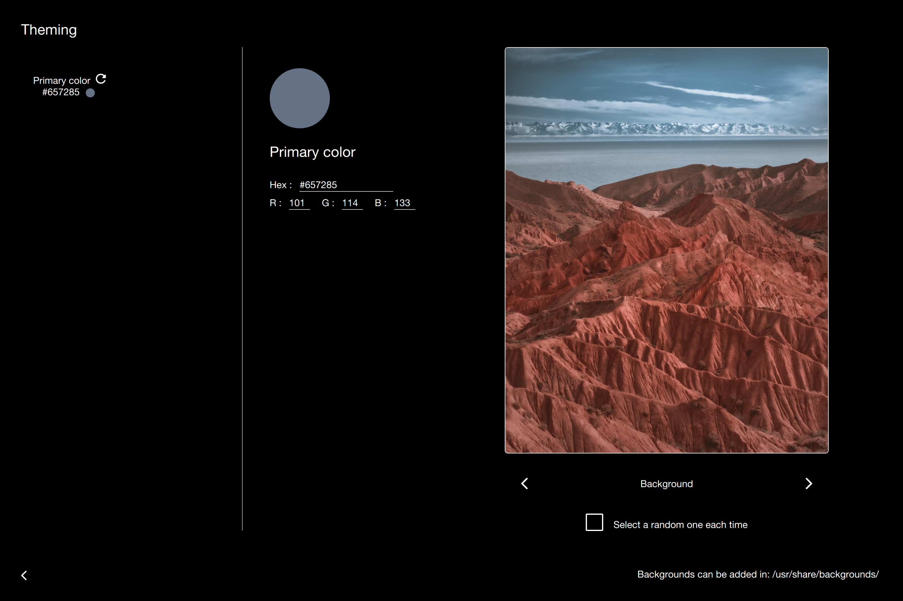

# Saluto

## Litarvan `lightdm-webkit2-greeter` Theme Fork

- [Saluto](#saluto)
  * [Litarvan `lightdm-webkit2-greeter` Theme Fork](#litarvan--lightdm-webkit2-greeter--theme-fork)
  * [Installation](#installation)
    + [Clone](#clone)
    + [Build & Install](#build---install)
    + [Editing LightDM Configurations](#editing-lightdm-configurations)
  * [Live Preview](#live-preview)
  * [Screenshots](#screenshots)
    + [Splash Screen](#splash-screen)
    + [Login Screen](#login-screen)
    + [Login Screen with Virtual Keyboard](#login-screen-with-virtual-keyboard)
    + [Login Screen with Clock](#login-screen-with-clock)
    + [Settings Screen](#settings-screen)
    + [Theming Screen](#theming-screen)

## Installation

In your shell…

### Clone

```sh
git clone https://github.com/Demonstrandum/Saluto.git
```

### Build & Install

```sh
cd Saluto
sh ./install.sh
```

You should have a read through `./install.sh` so you know what you’re running, and what you need your password for.

### Editing LightDM Configurations

- First make sure you’re using LightDM and `lightdm-webkit2-greeter` (which can both likely be installed with your system package manager).

- Edit `/etc/lightdm/lightdm.conf` to use `lightdm-webkit2-greeter`:

  ```ini
  [Seat:*]
  greeter-session=lightdm-webkit2-greeter
  ```

- Edit `/etc/lightdm/lightdm-webkit2-greeter.conf` to use this theme:

  ```ini
  [greeter]
  webkit_theme=saluto
  ```


## Live Preview

A live preview of what your greeter may look like may be viewed by either:

- Opening up the `index.html` file in the `dist/` folder generated after the install script has run.
- Launching the `lightdm-webkit2-greeter` executable, likely in your `PATH`, from your terminal or otherwise.
- Viewing this Github–Pages site: [demonstrandum.github.io/Saluto](https://demonstrandum.github.io/Saluto/)

## Screenshots

### Splash Screen


### Login Screen



### Login Screen with Virtual Keyboard



### Login Screen with Clock



### Settings Screen



### Theming Screen

